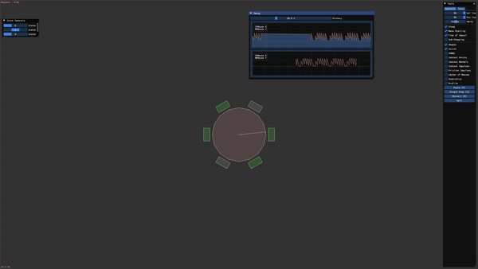

# Motor Sim
Few lines of code to add magnetic force simulation to a physics engine
Enabling you to simulate magnets and some fun fixtures like BLDC motors.





```cpp
b2Vec2 ComputeMagetForce(b2Vec2 PosK, b2Vec2 PosI, b2Vec2 MomentK, b2Vec2 MomentI)
{
    b2Vec2 dir = PosK - PosI;
    b2Vec2 NIK = 1.0f/dir.Length() * dir;
    b2Vec2 MagnetForce =
            1.0f / (dir.LengthSquared() * dir.LengthSquared()) *
            ((-15.0f * ((b2Dot(MomentK, NIK) * b2Dot(MomentI, NIK))) * NIK) +
            3.0f * b2Dot(MomentK, MomentI) * NIK +
            3.0f * (b2Dot(MomentI, NIK) * MomentK + b2Dot(MomentK, NIK) * MomentI)) ;
    return MagnetForce;
}

float ComputeMagetTorque(b2Vec2 PosK, b2Vec2 PosI, b2Vec2 MomentK, b2Vec2 MomentI)
{
    b2Vec2 dir = PosK - PosI;
    b2Vec2 NIK = 1.0f/dir.Length() * dir;
    float MagnetTorque =
    (3 * b2Cross(MomentK, NIK) * b2Dot(MomentI, NIK) -
    b2Cross(MomentK, MomentI)) /
    (dir.Length() * dir.Length() * dir.Length());
    return MagnetTorque;
}
```

